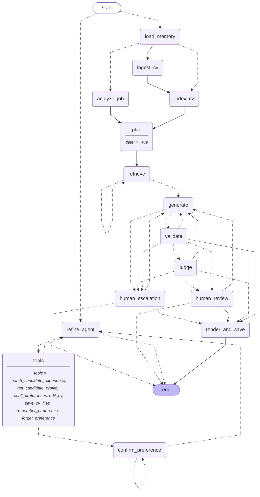

```mermaid
---
config:
  flowchart:
    curve: linear
---
graph TD;
	__start__([<p>__start__</p>]):::first
	load_memory(load_memory)
	ingest_cv(ingest_cv)
	index_cv(index_cv)
	analyze_job(analyze_job)
	retrieve(retrieve)
	generate(generate)
	validate(validate)
	judge(judge)
	human_review(human_review)
	human_escalation(human_escalation)
	render_and_save(render_and_save)
	plan(plan<hr/><small><em>defer = True</em></small>)
	refine_agent(refine_agent)
	confirm_preference(confirm_preference)
	tools(tools<hr/><small><em>__tools = search_candidate_experience, get_candidate_profile, recall_preferences, edit_cv, save_cv_files, remember_preference, forget_preference</em></small>)
	__end__([<p>__end__</p>]):::last
	__start__ -.-> load_memory;
	__start__ -.-> refine_agent;
	analyze_job --> plan;
	confirm_preference -.-> refine_agent;
	generate -.-> human_escalation;
	generate -.-> validate;
	human_escalation -.-> __end__;
	human_escalation -.-> generate;
	human_escalation -.-> render_and_save;
	human_review -.-> __end__;
	human_review -.-> generate;
	human_review -.-> render_and_save;
	index_cv --> plan;
	ingest_cv --> index_cv;
	judge -.-> generate;
	judge -.-> human_escalation;
	judge -.-> human_review;
	judge -.-> render_and_save;
	load_memory -.-> analyze_job;
	load_memory -.-> index_cv;
	load_memory -.-> ingest_cv;
	plan --> retrieve;
	refine_agent -.-> __end__;
	refine_agent -.-> tools;
	retrieve -.-> generate;
	tools -.-> confirm_preference;
	tools -.-> refine_agent;
	validate -.-> generate;
	validate -.-> human_escalation;
	validate -.-> human_review;
	validate -.-> judge;
	validate -.-> render_and_save;
	render_and_save --> __end__;
	confirm_preference -.-> confirm_preference;
	retrieve -.-> retrieve;
	classDef default fill:#f2f0ff,line-height:1.2
	classDef first fill-opacity:0
	classDef last fill:#bfb6fc
```
